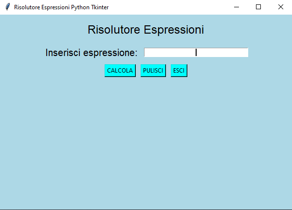
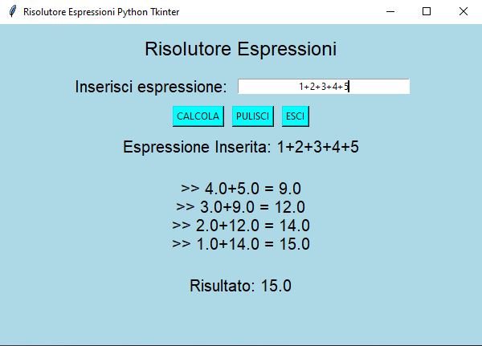
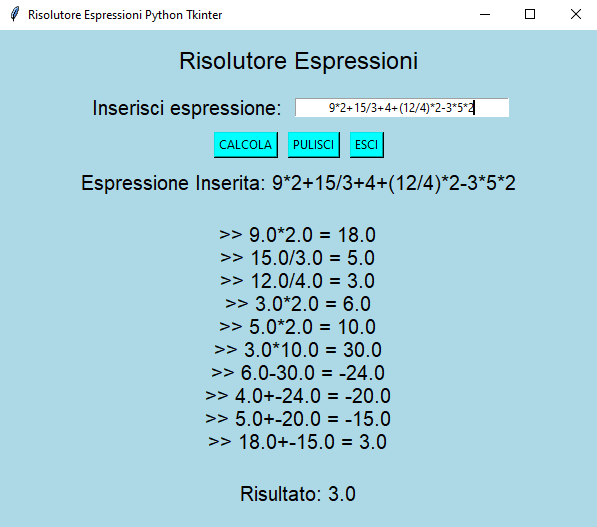
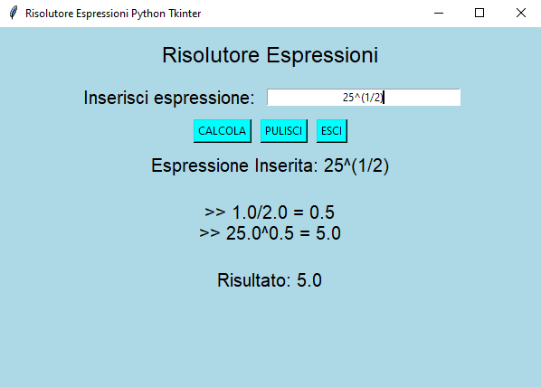
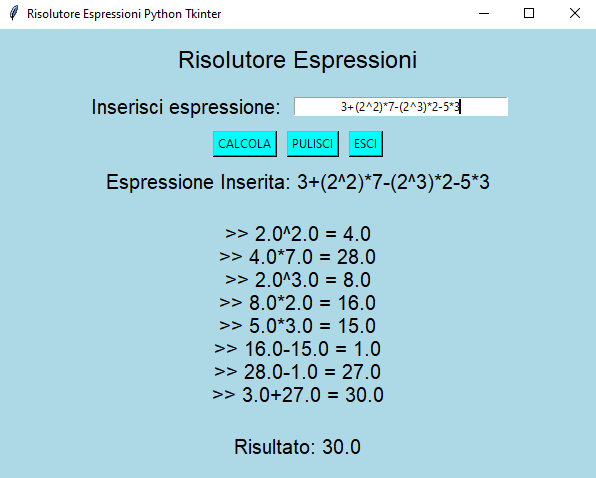

# Risolutore Espressioni

Questo è il mio personale e super affidabile Risolutore di Espressioni scritto completamente in Python utilizzando la fantastica libreria Tkinter! (**[Ho realizzato un corso base completamente gratuito e disponibile su Youtube dedicato a Tkinter](https://www.youtube.com/watch?v=W1De_q5ZD4E)**)

Se non mi credi mettiamo alla prova il mio programma provando a digitare la seguente espressione "_1+2+3+4+5_":

Come puoi vedere, non solo, il mio Risolutore di Espressioni calcola il risultato dell'espressione inserita ma ne mostra anche i passaggi!
Molto probabilmente non ti stupirai perchè l'espressione che ho inserito tu la risolveresti tranquillamente a mente, infatti, ho preparato alcune espressioni piuttosto laboriose da risolvere a mente:

Ora sei stupito?

# Per maggiori informazioni

Corso Base Completo Python Tkinter [Youtube]: https://www.youtube.com/watch?v=W1De_q5ZD4E

Created By Antonio Bernardini Copyright© 2020
