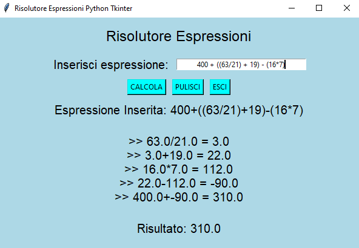

# Risolutore Espressioni

Questo è il mio personale e super affidabile Risolutore di Espressioni scritto completamente in Python utilizzando la fantastica libreria Tkinter! ([Ho realizzato un corso base completamente gratuito e disponibile su Youtube dedicato alla libreria Tkinter](https://www.youtube.com/watch?v=W1De_q5ZD4E))

Se non mi credi mettiamo alla prova il mio programma provando a digitare la seguente espressione _1+2+3+4+5_:

# Per maggiori informazioni

Created By Antonio Bernardini Copyright© 2020
